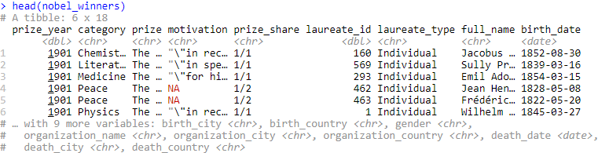
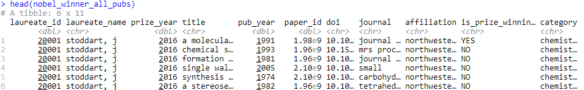

# Data/Operation Abstraction Design

## Data Description

For this project, the team selected data from one of the TidyTuesday projects on Nobel Prize winners available on GitHub. The dataset included two files, the first dataset provided details about all Nobel Prize winners since 1901, whereas, the second dataset included the details on all the publications by Nobel Prize winners for three of the categories (Chemistry, Physics, and Medicine). The first dataset, “nobel_winners”, included demographic details on 969 Nobel Prize winners from 1901 to 2016 and the motivation for awarding the nobel prize in their respective category (Economics, Peace, Literature, Chemistry, Physics, and Medicine). The second dataset, “nobel_winners_all_pubs”, included details on 545 academic professionals and their publications prior to winning the Nobel Prize.

## Overview of Data

<strong>Nobel Prize Data</strong>

```{r echo=FALSE}

```

<strong>All Publications of Nobel Prize Winners Data</strong>

```{r echo=FALSE}


```

These two datasets were utilized to create the application. As seen above in the "nobel_winners" data, there were a number of records that contained an "NA" observation. Therefore, those "NA" observations had to be addressed as well as other data cleaning matters.

<strong><em>Example of Removing "NA" Observations</em></strong>

```{r eval=FALSE}
text <- nobel_winner_all_pubs %>%
        filter(is_prize_winning_paper == "YES") %>%
        filter(prize_year >= input$year_journal_org[1] & prize_year <= input$year_journal_org[2]) %>%
        filter(!is.na(journal)) %>%
        count(journal) %>%
        arrange(desc(n))
```

Additionally, we also performed much of our data prep outside of the Shiny app. This was done to help minimize the number of lines of code within the actual app and to help organize the code for usage. The global data preperation included the creation of specific data frames and functions to be utilized within the application. 

<strong><em>Example of Function</em></strong>

```{r eval=FALSE}
getFreq_motivation <- function(data, prize_category, year1, year2) {
   
       tidy_motivation <- data %>%
              unnest_tokens(word, motivation) %>%
              anti_join(stop_words)
       
       if (prize_category != "All") {
              tidy_motivation_n <- tidy_motivation %>%
                     filter(category == prize_category) %>%
                     filter(prize_year >= year1 & prize_year <= year2) %>%
                     count(word) %>%
                     na.omit() %>%
                     arrange(desc(n))
       } else {
              tidy_motivation_n <- tidy_motivation %>%
                     filter(prize_year >= year1 & prize_year <= year2) %>%
                     count(word) %>%
                     na.omit() %>%
                     arrange(desc(n))        
       }
       
       return(tidy_motivation_n)
}
```

The function above was created to prepare the text to be utilized for in the Motivation and Paper Title Analysis section. This function - and another like it - were responsible for preparing the text to be used in the server to aid in the creation of the output.  

