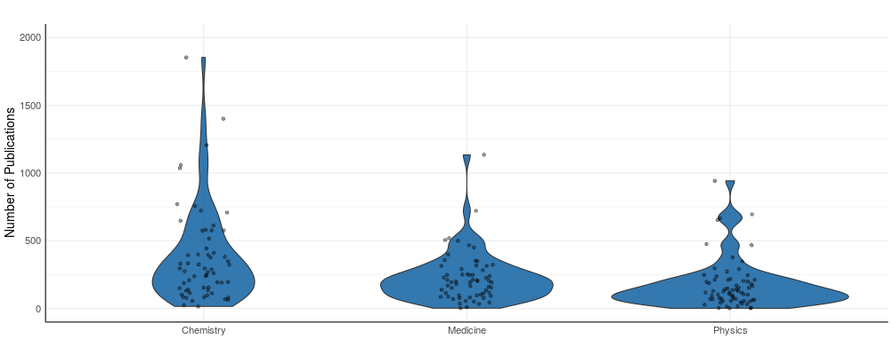

# Encoding/Interaction Design

The core of our application was divided into three sections on which to display our output. This was based on the division of the types of analyses deemed to be needed for this project.

## Overview

The "Overview" section was provided as a way for these institutions to get some general information on winners, journals and organization. Therefore, the output is reflective of this fact. Info boxes are provided to show general stats, which a table of the full output is provided for their reference if needed. A similar output is provided on the "Journals and Organizations" tab. However, instead of providing stats, the top journals and organizations producing Nobel Prize winners is provided. 

<strong>Winners Tab</strong>

```{r echo=FALSE}


```

<strong>Journals and Organizations Tab</strong>

```{r echo=FALSE}


```


## Motivation and Paper Title Analysis

The "Motivation and Paper Title Analysis" section was provided so these institutions could better understand their motivations as well as which papers typically do or do not get Nobel Prizes. 

The "Motivation for Award" tab shows which words typically show up in the institutions stated motivation for awarding the Nobel Prize to an individual. Therefore, this offers a great way for them to better understand their motivations for giving the awards they have in the past.

<strong>Motivation for Award Tab</strong>

```{r echo=FALSE}
knitr::include_graphics("images/word.PNG")

```

The "Paper Titles" tab is fairly similar. It provides the same output; however, it analyzes the titles of papers. This would allow these institutions to better understand which papers by these individuals have typically won a Nobel Prize and which have not. 

## Publication and Age Analysis

The “Publication and Age Analysis” section include the “Publication Analysis” and “Age Analysis” tabs, which would help the users to explore the academic and demographic characteristics of all Nobel Prize winners. 

In particular, the “Publication Analysis” tab allows users to study the academic characteristics of Nobel Prize winners among three categories (Chemistry, Physics, and Medicine). The first plot provides the violin distribution of the number of publications for Nobel Prize winners in their respective category, which helps to quantify the academic accomplishments of the winners. Also, the user can explore the variation in the distribution of the total number of publications over time by filtering for the range of prize awarded years. In addition to the violin distribution, the second plot on the tab allows users to investigate the average academic experience of Nobel Prize winners. Based on the selected range of prize awarded years, the output reveals the average academic experience of winners among three categories, which was calculated using the time between awarded year and the year of first publication.

<strong><em>Violin Plot</em></strong>

```{r echo=FALSE}


```

<strong><em>Horizontal Bar Chart</em></strong>

```{r echo=FALSE}


```

<strong><em>Publications Filter</em></strong>

```{r echo=FALSE}


```


The “Age Analysis” tab allow users to investigate the average age of Nobel Prize recipients and the total awards won by different  countries among all six award categories. The filter option for selecting the category and range of awarded years enable the users to understand the shift in demographic characteristics of winners over time across different countries. Moreover, the results for the average age of a recipient across countries, as shown in Figure XX, can be compared against the output table, which includes the list of countries from the bar chart and the number of awards won by each of them. 

